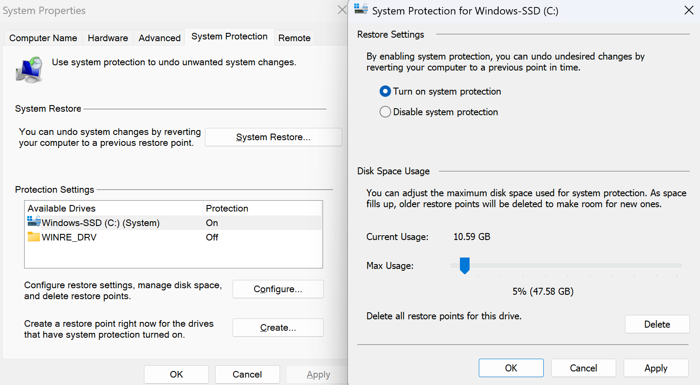
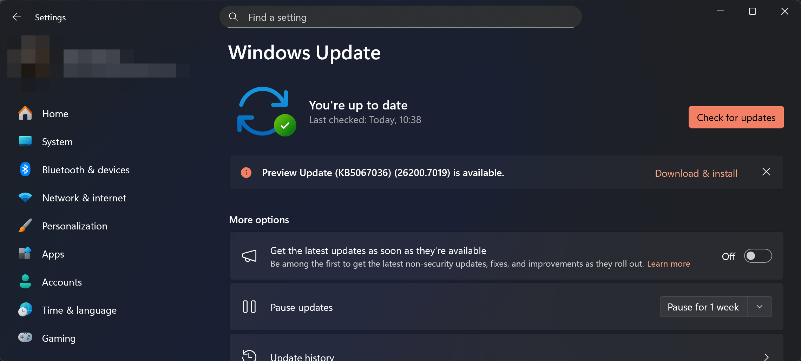
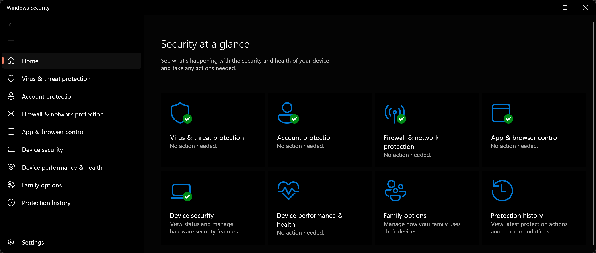
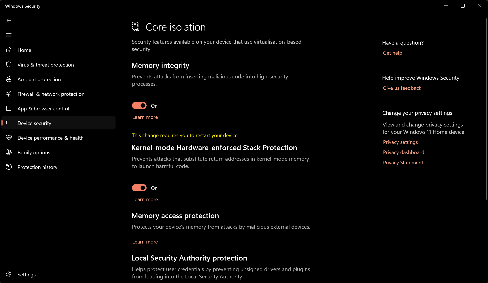

<picture>
  <source media="(prefers-color-scheme: dark)" srcset="../../Assets/Viper-Logo_White.png">
  <source media="(prefers-color-scheme: light)" srcset="../../Assets/Viper-Logo_Black.png">
  
</picture>

<br>

# `Part 1` Essential Windows Configurations

Harden Windows 11 with built-in controls and a few habits that reduce attack surface, protect data, and make recovery straightforward.

## Goal

Enable core defenses (Defender, phishing/PUA, Memory Integrity), use safer accounts (standard user + UAC), protect data (encryption, HTTPS/DoH), and prepare fast recovery (restore points, tested backups).

<br>

# `Chapter I`

> [!IMPORTANT]
> Many strong Defender protections exist but are **off** by default. We'll enable them with minimal breakage and clear rollback points.

<!--// Step 1 //-->
## `Step 1` Create a Restore Point (safety net)

**Open System Protection**

* Press **Win + R**, run `SystemPropertiesProtection`.

**Turn on protection (if off)**

* Select your system drive (usually **C: (System)**) > **Configure** > **Turn on system protection**.
* Set **Max Usage** to **5-10%** > **Apply** > **OK**.



> [!IMPORTANT]
> System Restore rolls back drivers, registry, and system files, **not** personal files. Keep a separate file backup.

**Create a point**

* **Create…** > name it (e.g., **Before GPU Driver Update**) > **Create**.

**Restore (if needed)**

* **System Restore…** > **Next** > select point > **Scan for affected programs** > **Finish** (PC restarts).

> [!TIP]
> Make a restore point **before** big driver changes, major tweaks, or software installs.

<!--// Step 2 //-->
## `Step 2` Keep Windows and Apps Updated

**Turn on automatic updates**

* **Settings > Windows Update** > enable automatic updates and install offered updates.
* Update Microsoft Store apps and any key third-party apps you rely on.



> [!TIP]
> Run a **Full scan** monthly; use **Microsoft Defender Offline scan** if something feels off.

<!--// Step 3 //-->
## `Step 3` Use a Standard Account + Strong Sign-in

**Daily use with a standard user**

* **Settings > Accounts > Other users** > **Add account** > set **Standard**.
* Use your **admin** account only for installs/changes. This limits what malware can do.

**Keep UAC on (default or higher)**

* **Start > type “UAC” > Change User Account Control settings** > keep at default or higher.

**Passphrase + Windows Hello**

* Choose a memorable **passphrase**; add **Windows Hello** (face/fingerprint) if available.

> [!IMPORTANT]
> Don't disable UAC. It's a key safety net against silent changes.

[](https://www.youtube.com/watch?v=CITkUwq0btY "Watch the video")

<!--// Step 4 //-->
## `Step 4` Turn On Microsoft Defender Essentials

**Windows Security > Virus & threat protection > Manage settings**

* **Real-time protection**, **Cloud-delivered protection**, **Automatic sample submission**: **On**

**Windows Security > App & browser control > Reputation-based protection (Settings)**

* **Phishing protection**: **On**
* **Potentially unwanted app (PUA) blocking**: **On** (Block apps + downloads)

**Windows Security > Virus & threat protection > Ransomware protection > Manage**

* **Controlled folder access**: **On** > add important folders; allow trusted apps if blocked.



> [!TIP]
> **Quick scan** = fast areas; **Full scan** = entire system; **Offline scan** = before Windows starts, useful for stubborn threats.

## `Step 5` Add Powerful Extras (ASR + Early Cloud Blocking)

Turn on Defender's advanced protections:

**Attack Surface Reduction (ASR) rules**
Block common attack paths (Office launching child processes, LSASS credential theft, signed-driver abuse).

* Open PowerShell **as Administrator** and **verify current state**:

  ```powershell
  Get-MpPreference | Select-Object AttackSurfaceReductionRules_Actions, MAPSReporting, SubmitSamplesConsent
  ```

* Start in **Audit** if you're cautious, then switch to **Block**.
* Optional helper: **ASR Configurator** (generates commands): `https://asrgen.streamlit.app/ASR_Configurator`

**Block at First Sight (cloud checks)**
Blocks suspicious new executables using Microsoft's cloud intelligence.

* **Windows Security > Virus & threat protection > Manage settings**
  Ensure **Cloud-delivered protection** and **Automatic sample submission** are **On**.

**Keep PowerShell default-restricted**

```powershell
Get-ExecutionPolicy -List
Set-ExecutionPolicy -Scope LocalMachine -ExecutionPolicy Restricted -Force
```

> [!WARNING]
> Some admin tools may need allow rules after enabling ASR. Prefer **precise exclusions** for known-good apps over disabling rules.

## `Step 6` Device Security and Encryption

**Memory Integrity (Core Isolation)**

* **Windows Security > Device security > Core isolation details** > **Memory integrity: On**.

**Encrypt the device**

* **Device encryption** (Home) or **BitLocker** (Pro).
* **Save the recovery key** to your Microsoft account **and** a USB/printout.



**Verify BitLocker (optional)**

```powershell
manage-bde -status
```

> [!IMPORTANT]
> Make sure you can retrieve the **recovery key** before enabling encryption to avoid lockouts.

## `Step 7` Safer Network, Browser, and Backups

**Encrypted DNS (DoH)**

* **Settings > Network & Internet > (Wi-Fi/Ethernet) > Hardware properties > Edit DNS**
  Set DNS servers and choose **Encrypted only (DNS over HTTPS)**.

**Use a privacy-respecting browser**

* Prefer Firefox/Brave with sane defaults; install extensions from official stores only.

**Two-location backups**

* Keep **one cloud** copy and **one offline** copy of important files.
* Test **restore** a file to confirm backups actually work.

## What You've Achieved

You now have: safer daily use (standard user + UAC), stronger Defender protections (real-time, cloud, PUA/phishing, ASR, ransomware controls), hardened device security (Memory Integrity + encryption), encrypted DNS, and a reliable recovery plan (restore points + tested backups).

## Checklist

* [ ] **Update Windows & apps** regularly
* [ ] **Use a standard user**, keep **UAC** on
* [ ] **Turn on Microsoft Defender** (real-time, cloud, PUA, phishing)
* [ ] **Enable device encryption**; save the **recovery key**
* [ ] **Turn on Memory Integrity** (Core isolation)
* [ ] **Use encrypted DNS** (DoH)
* [ ] **Back up important files**: one cloud + one offline

<br>

---

> [⮝ **Go to the Next Part** ⮝](../Part-2/Part-2.md)

---

> [⮝ **Go to the Overview Page** ⮝](../)

---
