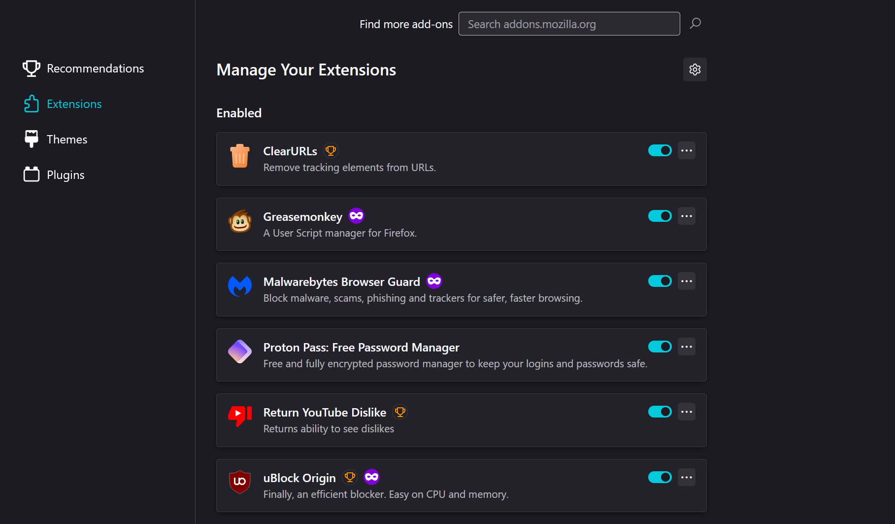
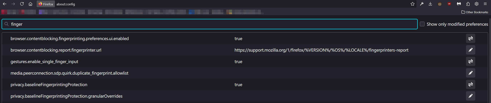

<picture>
  <source media="(prefers-color-scheme: dark)" srcset="../../Assets/Viper-Logo_White.png">
  <source media="(prefers-color-scheme: light)" srcset="../../Assets/Viper-Logo_Black.png">
  
</picture>

 

# `Part 2` Browser Security & Privacy

This Part secures your daily browsing on Windows with a hardened Firefox setup that reduces tracking, limits risky features, and keeps sites working.

## Goal

Configure Firefox for strong privacy and sensible security using built-in options first, then add minimal, high-impact extensions. Optional advanced tweaks are included for power users.

> [!IMPORTANT]
> Make changes in order. After each step, test 2–3 sites you use daily. If something breaks, add a **site exception**—don’t weaken global settings.

---

<!--// Step 1 //-->
## `Step 1` Set strong privacy defaults

1. Open **Menu > Settings > Privacy & Security**
2. **Enhanced Tracking Protection** > **`Strict`**
3. **HTTPS-Only Mode** > **`Enable in all windows`**
4. **Firefox Data Collection and Use** > **uncheck all** boxes

> [!TIP]
> `Strict` enables **Total Cookie Protection**, isolating cookies per-site to stop cross-site tracking.

---

<!--// Step 2 //-->
## `Step 2` Reduce passive data leaks

1. **Logins and Passwords** > **Turn off** `Ask to save passwords`
   *Use Bitwarden/Proton Pass instead.*
2. **Search** > **Default Search Engine** > pick **DuckDuckGo** or **Startpage**
3. **Search** > **uncheck** `Show search suggestions in address bar results`

> [!NOTE]
> Disabling suggestions prevents keystrokes from being sent to a search provider as you type.

---

<!--// Step 3 //-->
## `Step 3` Lock down device access & autoplay

1. **Permissions > Camera > Settings…** > **`Block new requests`**
2. **Permissions > Microphone > Settings…** > **`Block new requests`**
3. **Permissions > Location > Settings…** > **`Block new requests`** (add per-site later)
4. **Autoplay > Settings…** > **`Block Audio and Video`**

> [!IMPORTANT]
> You can allow a trusted site later via the prompt or **Site Information** panel (lock icon).

---

<!--// Step 4 //-->
## `Step 4` Tune cookies, history, and clearing (balanced)

1. **Cookies and Site Data** > (Optional) **check** `Delete cookies and site data when Firefox is closed`
   *If you need persistent logins, leave this off and use Containers instead.*
2. **History > Use custom settings**
   *Optionally uncheck* `Remember browsing and download history` for extra privacy.

> [!WARNING]
> Aggressive clearing will log you out everywhere. Prefer **Containers** to isolate sites without constant re-logins.

---

<!--// Step 5 //-->
## `Step 5` Enable DNS over HTTPS (DoH)

1. **Settings > General > Network Settings > Settings…**
2. **Enable DNS over HTTPS** > choose a trusted provider (or **Custom** if you have one)
3. **OK** to save.

> [!TIP]
> DoH encrypts DNS lookups on untrusted networks and can block known malicious domains via your resolver.

---

<!--// Step 6 //-->

## `Step 6` Add minimal, high-impact extensions

Install from **addons.mozilla.org** only.

1. **uBlock Origin**

   * Open **uBO Dashboard > Filter lists**
   * Keep defaults; optionally enable **uBlock – Annoyances** and **AdGuard URL Tracking Protection**.
2. **Firefox Multi-Account Containers**

   * **Extensions > Multi-Account Containers > Manage Containers**
   * Create: `Work`, `Banking`, `Shopping`, `Social`, `Google`
   * **Right-click tab > Reopen in Container** or set **Always open in** for key domains.
3. **Password manager extension** (Proton Pass)

   * Use this for autofill; keep Firefox’s password save **off** (Step 2).

> [!WARNING]
> Keep the list short. Random “privacy” add-ons, user-agent spoofers, and overlapping blockers often **increase** fingerprint uniqueness or break sites.

---

<!--// Step 7 //-->

## `Step 7` Optional hardening (`about:config` / `user.js`)

> Change **one** thing at a time; test; keep notes.

### A) `about:config` essentials

Open a tab > **`about:config`** > accept the warning.

* **DoH via prefs (if not set in GUI):**
  `network.trr.mode` > `2` *(TRR first, fallback to system)*
  *(Optional)* `network.trr.uri` > your DoH endpoint
* **Extra anti-fingerprinting (may cause quirks):**
  `privacy.resistFingerprinting` > `true`
* **Stricter autoplay if needed:**
  `media.autoplay.default` > `5`

### B) Curated `user.js` (managed baseline)

* **Betterfox** balanced, fast
* **arkenfox** stricter; may require per-site exceptions

**Install `user.js`:**

1. **`about:profiles` > Open Directory** (active profile)
2. Place `user.js` in that folder
3. **Restart Firefox**

> [!NOTE]
> Site isolation (“Fission”) ships enabled by default; no change required.

---

<!--// Step 8 //-->

## `Step 8` Daily use, exceptions & upkeep

* **Profiles for roles (optional):** `about:profiles` > create `Work` / `Personal` with their own extensions.
* **Containers for isolation:** keep Google/Meta/Banking in dedicated containers.
* **Per-site exceptions:**

  * Click the **shield** icon (left of URL) to relax protections **for that site only**.
  * Or use the **lock** icon > **Connection secure > More Information** for granular controls.
* **Maintenance (quarterly):** confirm updates auto-install, review Privacy settings, and prune unused extensions.

> [!NOTE]
> This setup delivers strong privacy without breaking daily browsing. If a site misbehaves, add a **site-specific exception** or open it in a **dedicated container**—don’t weaken your global baseline.

## Checklist

* [ ] **Enhanced Tracking Protection**: `Strict`
* [ ] **HTTPS-Only Mode** enabled
* [ ] **Telemetry** and data collection off
* [ ] **Privacy-respecting search** set as default
* [ ] **Block** camera, microphone, and location **by default**
* [ ] **Block Autoplay** (audio & video)
* [ ] **DNS over HTTPS (DoH)** enabled
* [ ] Install **uBlock Origin**
* [ ] Install **Firefox Multi-Account Containers**
* [ ] Use a **password manager** (disable Firefox password save)

 

---

> [⮝ **Go to the Next Part** ⮝](Part-3.md)

---

> [⮝ **Go to the Overview Page** ⮝](../)

---
