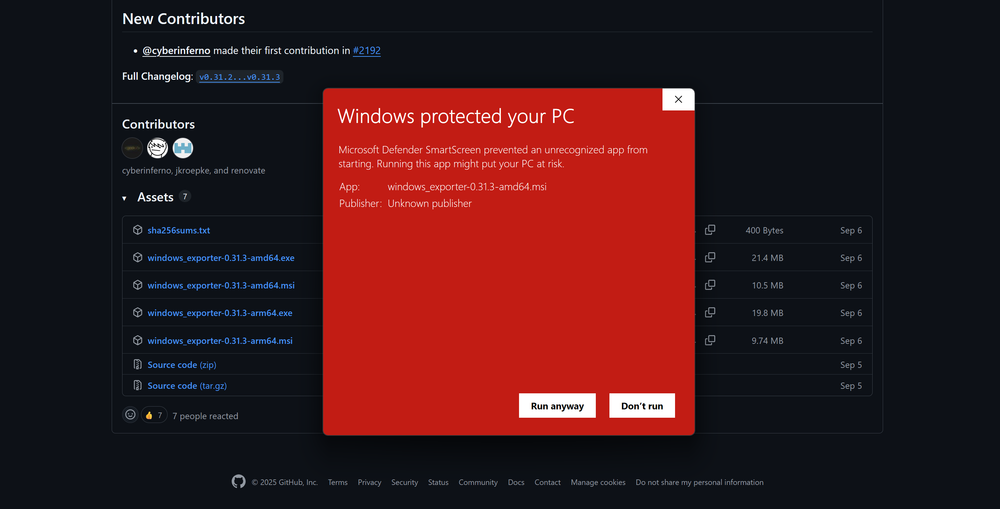
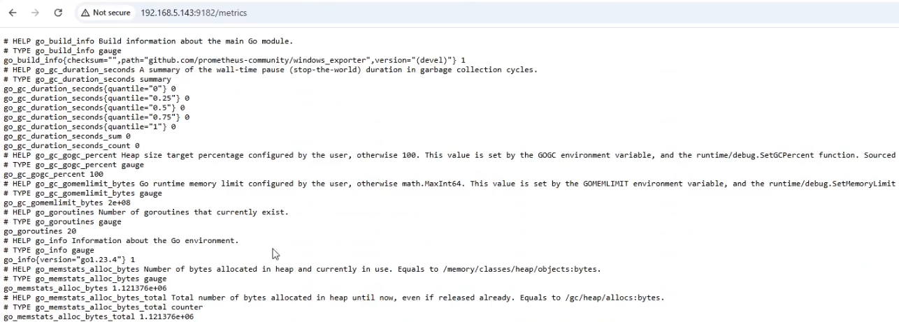
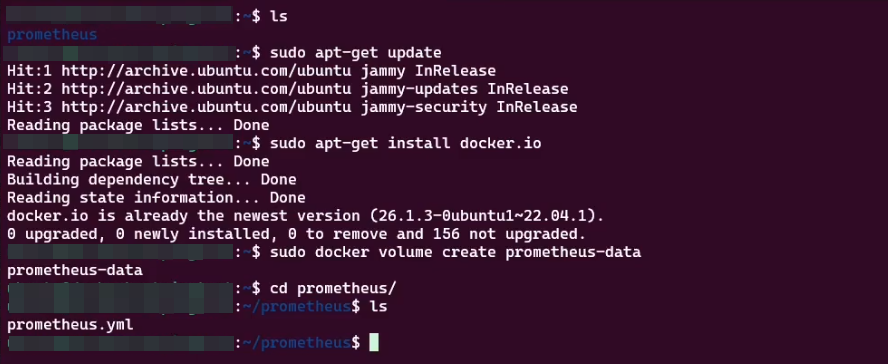
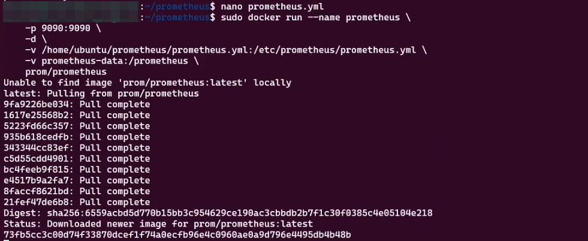
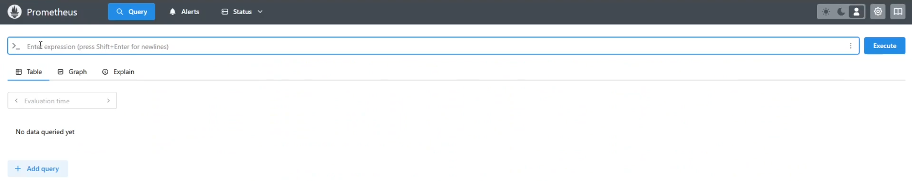
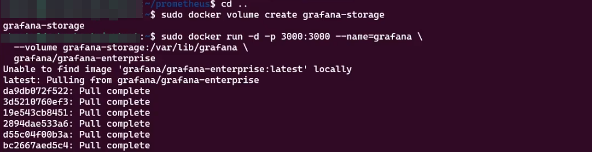
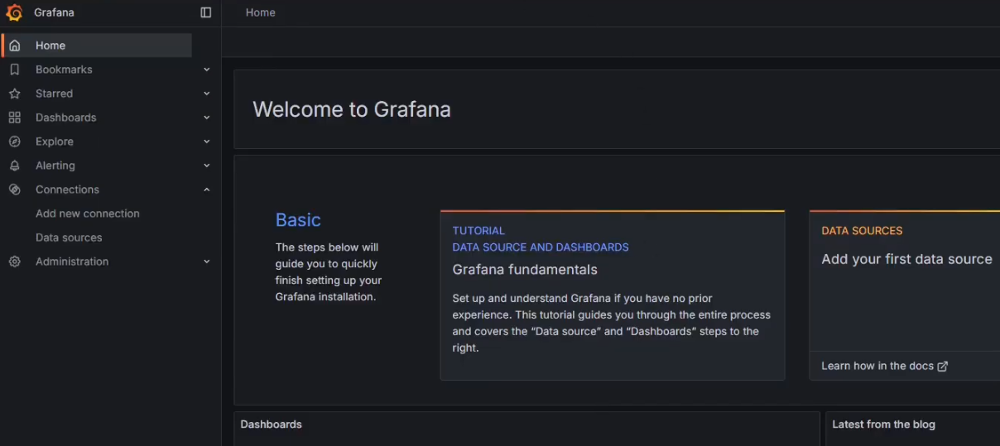
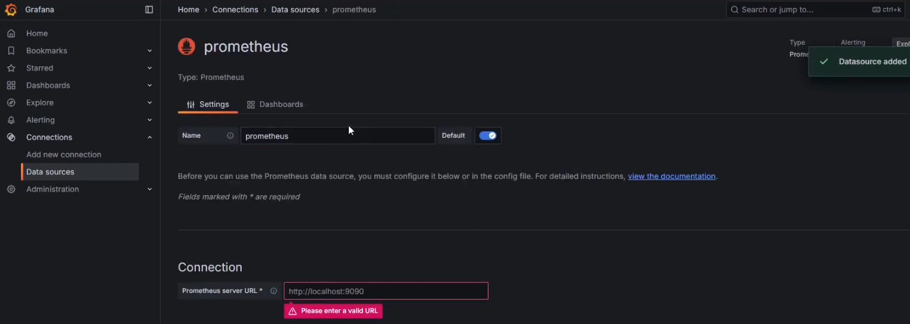
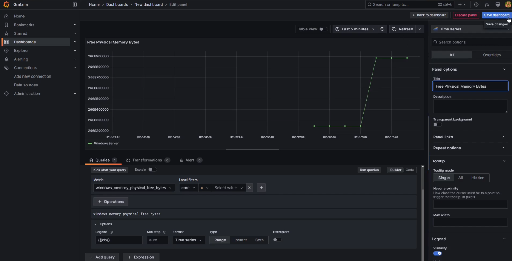
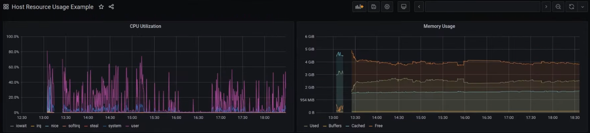

<picture>
  <source media="(prefers-color-scheme: dark)" srcset="../../Assets/Viper-Logo_White.png">
  <source media="(prefers-color-scheme: light)" srcset="../../Assets/Viper-Logo_Black.png">
  
</picture>

<br>

# `Part 5` Grafana Monitoring

**[Grafana](https://grafana.com/)** gives you a clear Window into your PC's health. In this part you will plug **[Grafana](https://grafana.com/)** into **[Prometheus](https://prometheus.io/)**, which reads metrics from **[Windows Exporter](https://github.com/prometheus-community/windows_exporter)** and build a simple dashboard you can use. The Goal is a small, fast setup that shows CPU, RAM Disk and Network Usage in real-time and is easy to keep running.

<!--// Goal // -->
## Goal

By the end, you will

* **Understand how [Grafana](https://grafana.com/)**, **[Prometheus](https://prometheus.io/)** and **[Windows Exporter](https://github.com/prometheus-community/windows_exporter)** work together
* **Connect [Grafana](https://grafana.com/)** to **[Prometheus](https://prometheus.io/)** and confirm metrics are flowing
* **Build a clean Windows Health Dashboard** for CPU, RAM, Disk and Network Usage
* **Add one simple alert** for a meaningful signal
* **Save Baseline screenshot** for before vs after tracking
* **Know how** to keep the setup lightweight on a single Laptop

<br>

# `Chapter I` Windows Exporter

## `Step 1` Install (MSI, defaults)

1. Download **Windows Exporter** (amd64 MSI).
2. Run the MSI, keep **defaults** for collectors.
3. Allow the **firewall exception** when offered.
4. Finish install.

> [!TIP]
> After install, Windows Exporter serves metrics on **port 9182**.



## `Step 2` Find your Windows IP & test

Open **PowerShell** on Windows

```powershell
ipconfig | findstr /i "IPv4"
start http://<YOUR-WINDOWS-IP>:9182/metrics
```

You should see a long text page with metrics.

> [!WARNING]
> If the page doesn't load from other machines later, add an **Inbound rule TCP 9182** in Windows Defender Firewall.



<br>

# `Chapter II` Prometheus (WSL/Ubuntu + Docker)

We'll run Prometheus in Docker, scrape your Windows Exporter, and publish **9090**.

## `Step 1` Create config

Run these **inside WSL/Ubuntu**

```bash
sudo mkdir -p /root/prometheus
sudo tee /root/prometheus/prometheus.yml > /dev/null <<'EOF'
global:
  scrape_interval: 15s

scrape_configs:
  - job_name: "windows"
    static_configs:
      - targets: ["<YOUR-WINDOWS-IP>:9182"]
EOF
```

Replace `<YOUR-WINDOWS-IP>` with the IPv4 you saw in Chapter I.

Validate the YAML:

```bash
sudo docker run --rm -v /root/prometheus:/etc/prometheus:ro prom/prometheus \
  promtool check config /etc/prometheus/prometheus.yml
```

You should see **SUCCESS**.



## `Step 2` Run Prometheus

Create a small network for later and start the container

```bash
sudo docker network create monitor-net 2>/dev/null || true
sudo docker rm -f prometheus 2>/dev/null || true
sudo docker volume create prometheus-data >/dev/null

sudo docker run -d --name prometheus \
  --network monitor-net \
  -p 9090:9090 \
  -v /root/prometheus:/etc/prometheus:ro \
  -v prometheus-data:/prometheus \
  prom/prometheus \
  --config.file=/etc/prometheus/prometheus.yml
```

Verify it's up:

```bash
sudo docker ps --format 'table {{.Names}}\t{{.Status}}\t{{.Ports}}'
curl -s http://localhost:9090/-/ready
```



Open **[http://localhost:9090/targets](http://localhost:9090/targets)** in your Windows browser; the `windows` job should be **UP**.

> [!IMPORTANT]
> In WSL2, **use `http://localhost:9090`** from Windows. Don't use your Windows LAN IP for Prometheus; it runs inside WSL's VM.



<br>

# `Chapter III` Grafana (WSL/Ubuntu + Docker)

## `Step 1` Run Grafana

```bash
sudo docker rm -f grafana 2>/dev/null || true
sudo docker volume create grafana-storage >/dev/null

sudo docker run -d --name grafana \
  --network monitor-net \
  -p 3000:3000 \
  -v grafana-storage:/var/lib/grafana \
  grafana/grafana
```



Open **[http://localhost:3000](http://localhost:3000)**
Login: `admin` / `admin` > change password when prompted.



## `Step 2` Add data source (Prometheus)

Grafana UI > **Connections** > **Data sources** > **Add data source** > **Prometheus**

* **URL:** `http://prometheus:9090`
* Save & Test > should be **green**.

> [!TIP]
> We placed Prometheus and Grafana on the same Docker network (`monitor-net`), so `prometheus:9090` resolves by container name.



<br>

# `Chapter IV` First Dashboard

## `Step 1` Create two panels

Grafana > **Dashboards** > **New** > **New dashboard** > **Add visualization**

**Panel 1 (CPU):**

* **Data source:** Prometheus
* **Query:** `windows_cpu_time_total`
* (Optional) filter `mode` label or aggregate by core

**Panel 2 (Memory or Disk):**

* **Query (memory):** `windows_memory_available_bytes`
* **or Disk C::** `windows_logical_disk_free_bytes{volume="C:"}`



Set time range to **Last 5 minutes**.
Open some apps on Windows (Calculator, Explorer), wait a few seconds, and watch the panels change.



> [!NOTE]
> Keep it simple: CPU, RAM, Disk, Network. Set reasonable refresh (5-15s).

## `Step 2` Optional: one alert

Grafana > **Alerting** > **Alert rules**
Create a rule like **“C: free < 10%”** and point it at your disk panel query.

<br>

<!--// Checklist // -->
## Checklist

* [ ] **[Windows Exporter](https://github.com/prometheus-community/windows_exporter) reachable** on your PC
* [ ] **[Prometheus](https://prometheus.io/) scraping** the Windows target and showing metrics
* [ ] **[Grafana](https://grafana.com/) running** and secured with a new admin password
* [ ] **[Prometheus](https://prometheus.io/) data source** added in **[Grafana](https://grafana.com/)** and tested
* [ ] **Starter dashboard created** or imported with Core Panels mentioned
* [ ] **One alert rule** added for key risk, such as low free disk
* [ ] **Sensible refresh rate** set and dashboard saved
* [ ] **Baseline screenshots** captured for your report

<br>

---

> [⮝ **Go to the Next Part** ⮝](../Part-5/Part-5.md)

---

> [⮝ **Go to the Overview Page** ⮝](../)

---
