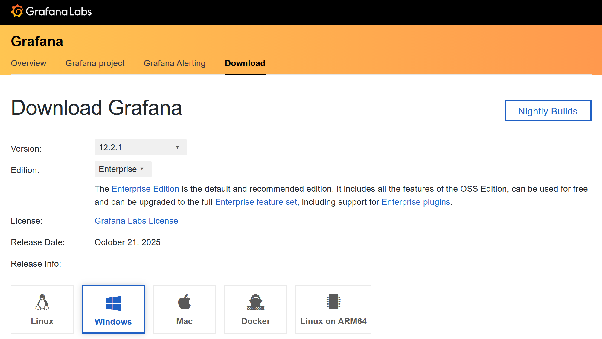

# `Part` Grafana Monitoring

## Goal

Get a local monitoring stack running on your laptop:
**windows_exporter → Prometheus → Grafana**, with a ready-made Windows dashboard.

## What you’ll install (in this order)

1. **Grafana** (UI to visualize)
2. **Prometheus** (time-series database + scrapes metrics)
3. **windows_exporter** (collects Windows hardware/OS metrics)

<!--// Step 1 //-->
## `Step 1` Install Grafana (Windows)

1. Download the **Grafana OSS for Windows** installer (MSI) from Grafana’s official docs/downloads.



2. Run the installer → keep defaults (it registers **Grafana** as a Windows service).
3. After install, open: **[http://localhost:3000](http://localhost:3000)**
   Default login: `admin` / you’ll set a new password on first login.
   *(If the service didn’t start, launch “Services”, start **grafana**.)*
   *Why these steps? They’re the vendor-recommended Windows flow.* ([Grafana Labs][1])

<!--// Step 2 //-->
## `Step 2` Install Prometheus (Windows)

1. Go to **prometheus.io/download** and download the **Windows** ZIP for Prometheus (latest release).
   Extract it to a simple path, e.g. `C:\Prometheus`.

2. Create `C:\Prometheus\prometheus.yml` with this minimal config:

   ```yaml
   global:
     scrape_interval: 15s

   scrape_configs:
     - job_name: "windows"
       static_configs:
         - targets: ["localhost:9182"]   # windows_exporter default
   ```

3. Start Prometheus in a terminal (PowerShell) from its folder:

   ```powershell
   cd C:\Prometheus
   .\prometheus.exe --config.file=prometheus.yml
   ```

4. Verify Prometheus is up: **[http://localhost:9090](http://localhost:9090)** → “Status → Targets” will be empty/Down until we install the exporter in the next step.
   *(Prometheus on Windows is officially shipped as a ZIP; running it like this is the normal path.)*

> [!TIP]
> Keep this terminal open for now. Later you can turn Prometheus into a service, but running it in a window is simplest while you test.

<!--// Step 3 //-->
## `Step 3` Install windows_exporter (Windows metrics)

1. Download **windows_exporter** (formerly wmi_exporter). The standard distribution provides an **MSI** that installs it as a **Windows service** and exposes metrics on **[http://localhost:9182/metrics](http://localhost:9182/metrics)** by default.
   (You’ll see “Windows Exporter” in Services after install.) ([guides.hakedev.com][2])
2. Run the MSI → accept defaults.
3. Verify in your browser: **[http://localhost:9182/metrics](http://localhost:9182/metrics)** (a long text page of `cpu`, `logical_disk`, `os`, etc. metrics means it’s working).
4. Go back to **Prometheus** → **Status → Targets**. The `windows` job should now show **UP**.

> [!NOTE]
> If you have a strict firewall, allow **localhost** inbound for ports **9182** (exporter) and **9090** (Prometheus) and **3000** (Grafana) on **Private** networks.

<!--// Step 4 //-->
## `Step 4` Connect Grafana to Prometheus

1. Open Grafana → **Connections → Data sources → Add data source**.
2. Choose **Prometheus**.
3. **URL:** `http://localhost:9090` → **Save & test** (should say *Data source is working*).

<!--// Step 5 //-->
## `Step 5` Import a Windows dashboard (ready-made)

1. In Grafana, go to **Dashboards → Import**.
2. In the Import screen, use **“Load from Grafana.com”** and search for “**windows_exporter**” or “**Windows**” dashboards. Pick one with good reviews/maintainers (these are community dashboards built for `windows_exporter`).
3. When asked to select a data source, choose your **Prometheus** data source from Step 4.
4. Open the new dashboard and you should immediately see CPU, memory, disks, network, services, etc.

> [!TIP]
> The transcripts you shared show the same pattern with Linux `node_exporter` and the “Node Exporter Full” dashboard. On Windows the equivalent dashboards reference **`windows_exporter`** metrics — the flow is identical, only the exporter name differs.

<!--// Step 6 //-->
## `Step 6` (Optional) Build a simple panel yourself (to learn the flow)

1. Grafana → **+ → Dashboard → Add visualization → Prometheus**.

2. Query CPU time (example):

   ```
   100 - (avg by (instance) (rate(windows_cpu_time_total{mode="idle"}[5m])) * 100)
   ```

3. Set **Legend**, pick a **Time series** visualization, **Apply**.
   This mirrors the “query → panel → save” process shown in your transcripts.

---

## `Step 7` Make it start automatically (nice-to-have)

* **Grafana**: already runs as a Windows service (from MSI). ([Grafana Labs][1])
* **windows_exporter**: installed as a Windows service by the MSI. ([guides.hakedev.com][2])
* **Prometheus**: if you want it to run at boot, you can keep using a shortcut in Startup for simplicity, or later wrap it as a Windows service using a service wrapper. (Do this after you’ve verified everything works interactively.)

---

## Troubleshooting (fast)

* **Exporter page doesn’t load:** check **Services** → *windows exporter* is **Running**; otherwise start it. Verify **[http://localhost:9182/metrics](http://localhost:9182/metrics)**.
* **Prometheus “Target DOWN”**: confirm `targets: ["localhost:9182"]` in `prometheus.yml` and restart Prometheus.
* **Grafana can’t query:** Data source URL must be `http://localhost:9090` and “Save & test” must succeed.
* **No graphs:** Make sure the dashboard you imported is for **windows_exporter**, not the Linux `node_exporter`.

---

## What you just built (matches the transcripts’ architecture)

**windows_exporter → Prometheus (scrape) → Grafana (visualize dashboards)**
Same pipeline the videos used with `node_exporter` — just swapped for Windows’ exporter. Once this is up, you can add alerts later (Prometheus alerting or Grafana alert rules) and extend with other exporters exactly the same way.

---

### References

* Grafana installation & service on Windows (official docs). ([Grafana Labs][1])
* Prometheus Windows download (official).
* Windows exporter (MSI installs as a Windows service, exposes metrics on a local port) — tutorial summary. ([guides.hakedev.com][2])
* Grafana → Add Prometheus data source (official).

If you want, I can package the Prometheus YAML and a known-good Windows dashboard JSON for you next, so it’s literally drop-in.

[1]: https://grafana.com/docs/grafana/latest/setup-grafana/installation/windows/ "Install Grafana on Windows | Grafana documentation
"
[2]: https://guides.hakedev.com/wiki/windows/windows-exporter/?utm_source=chatgpt.com "Windows Exporter | Hake Hardware"
