<picture>
  <source media="(prefers-color-scheme: dark)" srcset="../../Assets/Viper-Logo_White.png">
  <source media="(prefers-color-scheme: light)" srcset="../../Assets/Viper-Logo_Black.png">
  
</picture>

<br>

# `Part-6` Wazuh Threat Detection

**[Wazuh](https://wazuh.com/)** gives you clear, on-device threat detection and change visibility. In this part you will install the **Wazuh agent** on Windows, connect it to your **Wazuh manager**, and view alerts in the **Wazuh Dashboard**.

**Wazuh watches** logins, admin group changes, file integrity, and suspicious processes, then turns them into readable alerts you can act on. The goal is a small, low-overhead setup that tells you what changed, when, and where, with one quick test to prove it works.

<!--// Goal // -->
## Goal

By the end, you will

* **Install a single-node [Wazuh](https://wazuh.com/) stack** (Manager, Indexer, Dashboard) with Docker and generated TLS certs.
* **Bring the stack online** and sign in to the **Wazuh Dashboard** on your machine.
* **Install and configure the Wazuh Agent** on Windows and point it at your Manager.
* **Create and apply an agent key** using `manage_agents` in the Manager container, then confirm the agent shows **Connected**.
* **Verify and control the agent service** on Windows with `Get-Service` / `Restart-Service`, and see alerts appear in the Dashboard.
* **Keep it lightweight on one laptop** by knowing how to start/stop the Docker stack safely.

<br>

# `Chapter I` Wazuh Manager Installation

## `Step 1` Prerequisites

* Windows 10/11 as target system  
* **Docker Desktop** installed  
* **Wazuh Manager** and **Wazuh Agent** components  
* Reference documentation: [Wazuh Docker Deployment](https://documentation.wazuh.com/current/deployment-options/docker/wazuh-container.html#single-node-stack)

> [!IMPORTANT]
> Make sure Docker Desktop is running before starting any of the following commands.

## `Step 2` Prepare Project Folder

Start **PowerShell** as Administrator and create your local project directory:

```bash
mkdir C:\Projects\01_local_hardening
cd C:\Projects\01_local_hardening
```

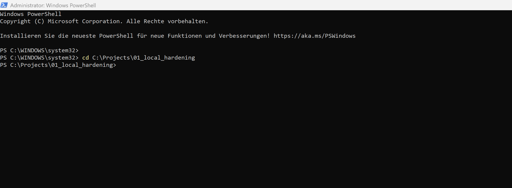

The folder is now ready.

Next, clone the Wazuh Docker repository (version `v4.14.0`) to your system:

```bash
git clone https://github.com/wazuh/wazuh-docker.git -b v4.14.0
```

Once cloning is complete, you can view the repository contents.

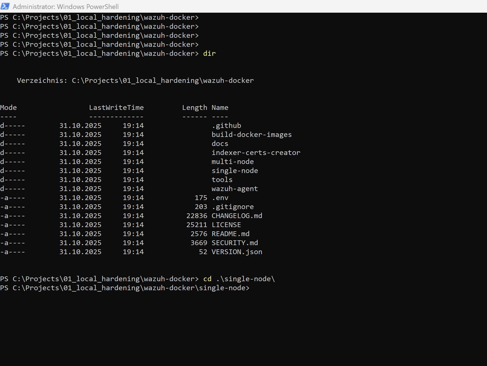

Now, navigate into the `single-node` folder:

> [!TIP]
> All further commands should be run **inside** this directory.

---

## `Step 3` Generate Certificates

Run the following command to generate TLS certificates for secure communication:

```bash
docker compose -f generate-indexer-certs.yml run --rm generator
```

This will create certificates in the `config\certs\` directory.

> [!IMPORTANT]
> Ensure you are in the `single-node` folder before running this command.

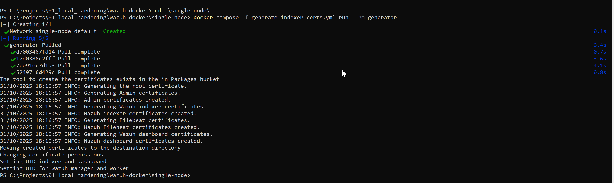

## `Step 4` Start the Wazuh Stack (Manager + Indexer + Dashboard)

Bring up the Wazuh Docker stack with:

```bash
docker compose up -d
```

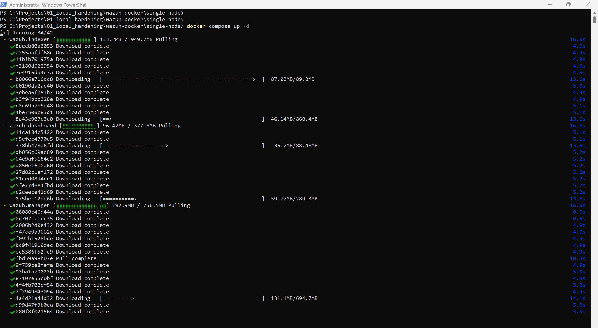

Once containers are running, open your browser and go to:

```bash
http://localhost
```

You should now see the Wazuh Dashboard interface.

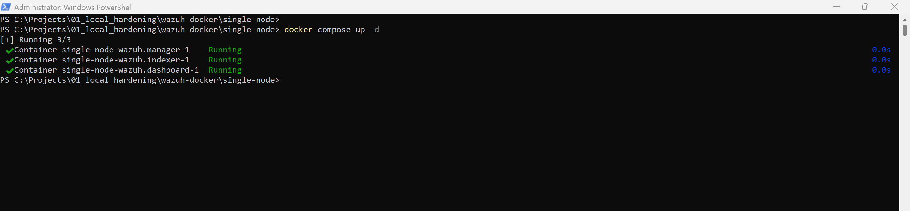
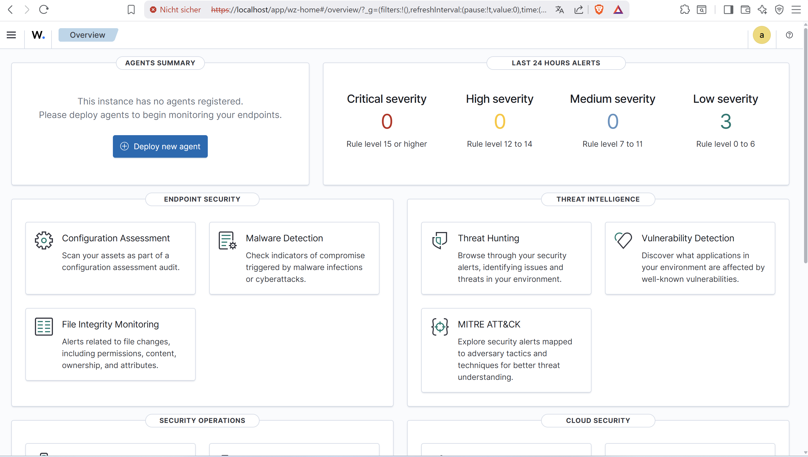

> [!TIP]
> Default login credentials can be found in the official Wazuh Docker documentation.

<br>

# `Chapter II` Wazuh Agent Connection

## `Step 1` Prerequisites

* Wazuh Dashboard is up and running  
* Local system (laptop or workstation) ready  
* Reference: [Agent installation for Windows](https://documentation.wazuh.com/current/installation-guide/wazuh-agent/wazuh-agent-package-windows.html)

## `Step 2` Install the Agent on Your Local System

Open the above link in your browser and download the Windows Agent installer.

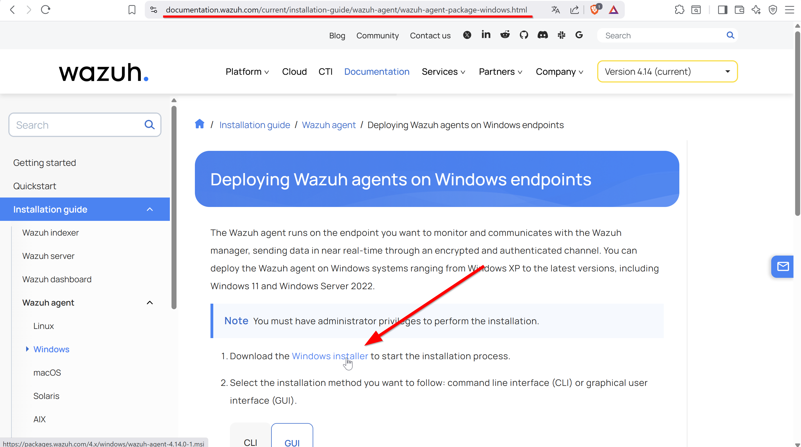

After downloading, execute the installer and follow the setup wizard.

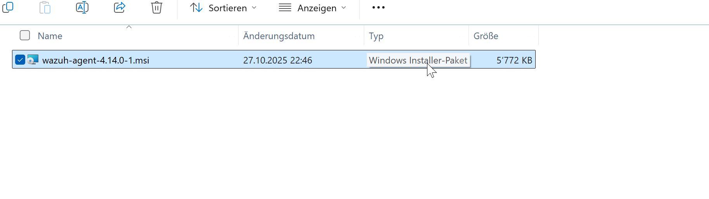
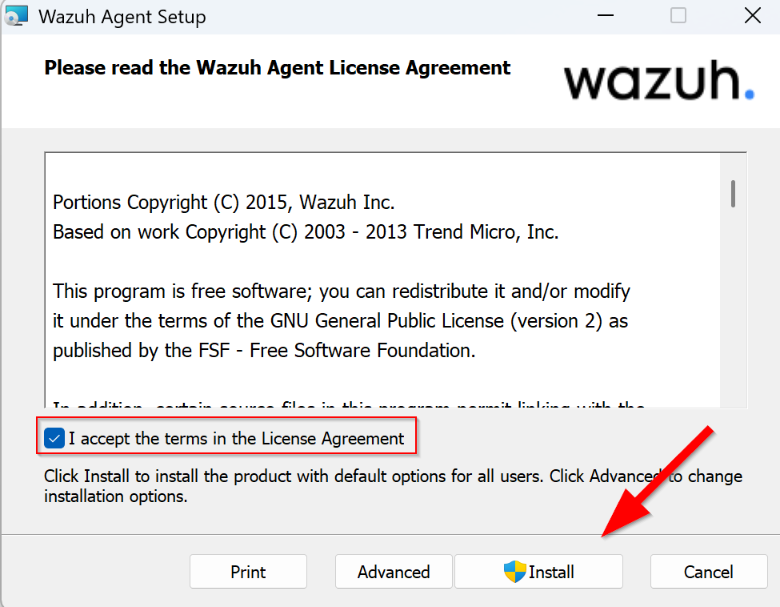

Accept the license agreement and complete installation.

## `Step 3` Start and Verify the Service

Check if the Wazuh Agent service is running with the following PowerShell commands:

```bash
Get-Service Wazuh
```

If not started:

```bash
Start-Service Wazuh
```

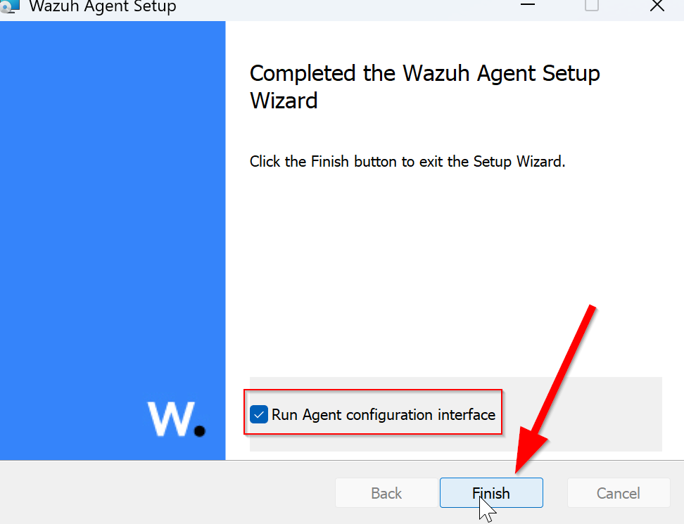

## `Step 4` Configure the Agent

During installation, make sure to enable:

> **Run agent configuration interface**

This opens the configuration window after setup.

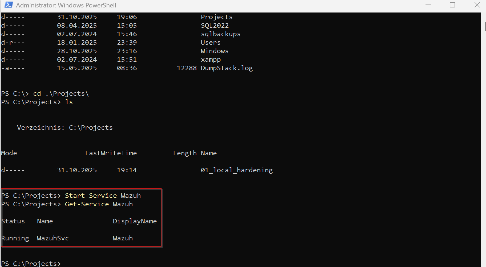

Enter the following:

* **Manager address:** `127.0.0.1` (default for localhost)
* **Agent key:** leave blank for now (we’ll generate it next)

Now open PowerShell **as Administrator** and access the Wazuh Manager container:

```bash
docker exec -it single-node-wazuh.manager-1 bash
```

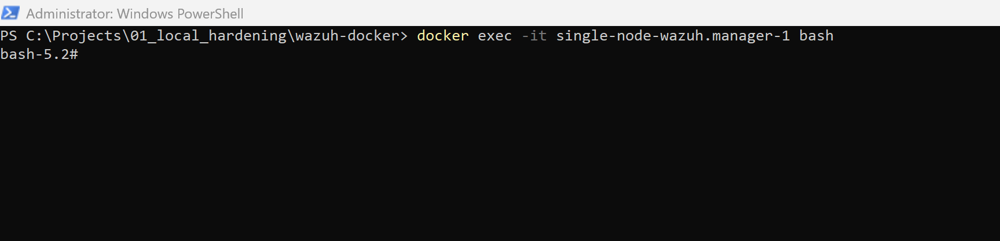

Inside the container, start the agent management utility:

```bash
/var/ossec/bin/manage_agents
```

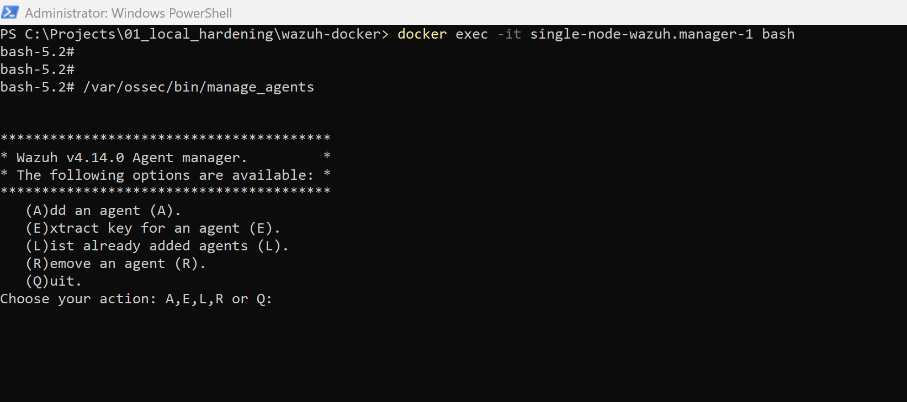

Select **Add agent** (option 1).

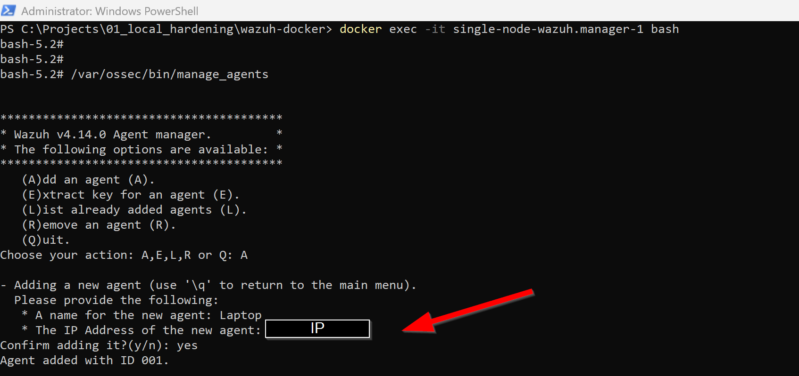

Enter

* Agent name (your device name)
* IP address (find with `ipconfig` on Windows)

## `Step 5` Extract the Agent Key

You’ll now need to generate and copy the **agent key** for your device.

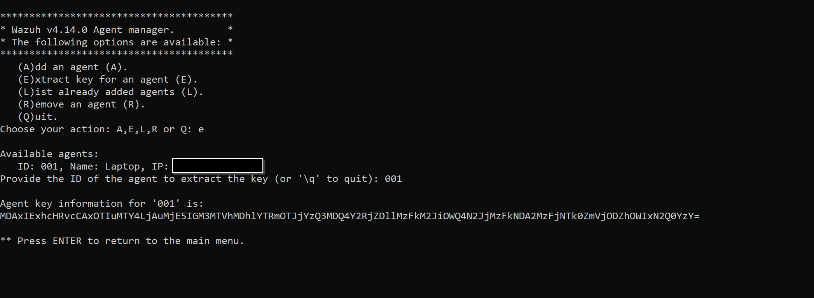

Enter your assigned **Agent ID (e.g., 001)** and copy the displayed key.

Return to the Agent Configuration window, paste the key, and click **Save**.

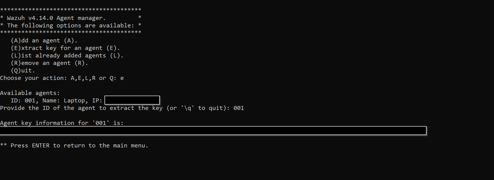

## `Step 6` Restart the Wazuh Agent Service

Restart the service to apply configuration:

```bash
Restart-Service Wazuh
Get-Service Wazuh
```

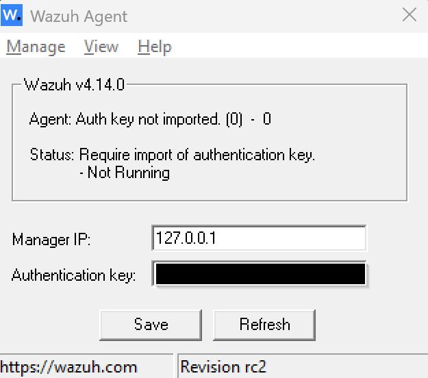

After a few moments, the agent should appear as connected in your Wazuh Dashboard.

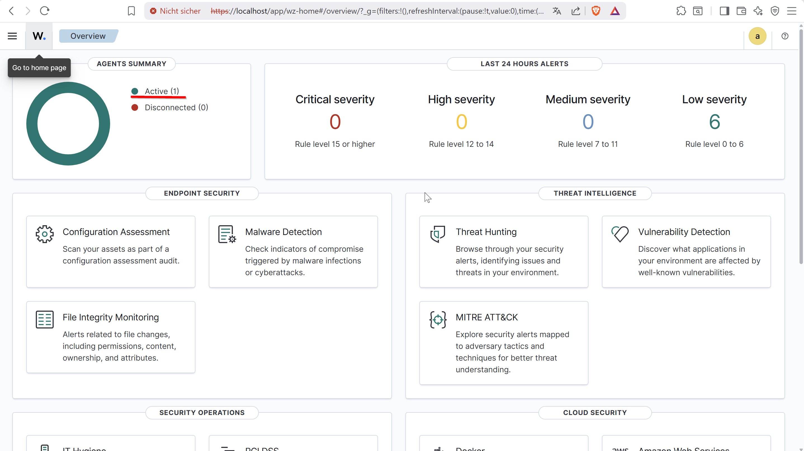

> [!TIP]
> You can verify connection status in **Wazuh Dashboard > Agents > Status**.

<br>

## Summary

You’ve successfully set up:

1. The **Wazuh Manager** stack (Manager, Indexer, Dashboard) via Docker.  
2. A **Windows Wazuh Agent** connected and verified in the dashboard.  

> [!IMPORTANT]
> Keep Docker Desktop running whenever you need the Wazuh Manager online.

<!--// Checklist // -->

## Checklist

* [ ] **[Wazuh](https://wazuh.com/) stack running** (Manager, Indexer, Dashboard reachable)
* [ ] **Windows [Wazuh Agent](https://documentation.wazuh.com/current/installation-guide/wazuh-agent/index.html) installed** and **Connected** in Dashboard
* [ ] **Basic monitoring active** (logins, admin changes, file changes) and events arriving
* [ ] **One safe test performed** and **alert visible** (end-to-end proof)
* [ ] **Core settings saved** (manager address, agent name/group, auto-start)
* [ ] **Optional modules reviewed** (File Integrity, Vulnerabilities, Sysmon/Registry) and enabled where useful
* [ ] **Dashboard kept simple** (saved view/search for your host)
* [ ] **Baseline screenshots captured** for your report

<br>

---

> [⮝ **Go to the Overview Page** ⮝](../)

---
