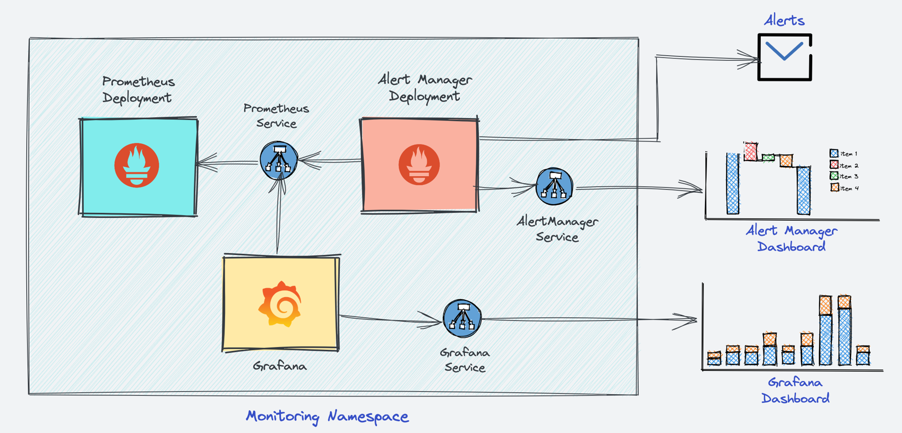
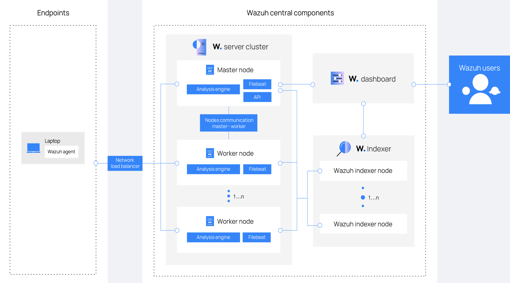

   <picture>
      <source media="(prefers-color-scheme: dark)" srcset="Assets/Viper-Logo_White.png">
      <source media="(prefers-color-scheme: light)" srcset="Assets/Viper-Logo_Black.png">
      
   </picture>

  [![Issues][issues-shield]][issues-url]
  [![Stars][stars-shield]][stars-url]
  [![Commits][commits-shield]][commits-url]
  [![License][license-shield]][license-url]

  

    Welcome to our Local-Hardening Project!
     
    <a href="#overview">Overview</a>
    ·
    <a href="#let's-get-started">Get Started</a>
    ·
    <a href="Docs/">Documentation</a>
    ·
    <a href="#license">License</a>
  

   

  <h1>Architecture</h1>

# Overview

## What You Will Learn

In this project, you'll learn how to harden a local Windows system and make the effectiveness of the applied security measures measurable. You'll use the open-source security platform **Wazuh** as a **Host-based Intrusion Detection System (HIDS)** to continuously monitor the system, detect suspicious activity or configuration changes, and provide transparent evidence of the system’s security state.

You will also learn how to use **Grafana** with **Prometheus** and **Windows Exporter** to monitor the system's health and performance in real-time.

**You'll also learn how to...**

- Build a clean baseline and harden Windows safely
- Secure your browser and day to day privacy (Firefox and Proton)
- Set up on-device threat detection and readable alerts with Wazuh
- See live system health with Grafana, Prometheus and Windows Exporter
- Verify changes and measure progress with before and after checks
- Keep thigns in check with custom built scripts and an easy rollback plan

## Used Tools

- [**`Grafana`**](https://grafana.com/) **Visualize** and explore metrics and logs.
- [**`Windows Exporter`**](https://github.com/prometheus-community/windows_exporter) **Expose** Windows performance metrics for Prometheus.
- [**`Prometheus`**](https://prometheus.io/) **Collect**, store, and alert on time-series metrics.
- [**`Wazuh`**](https://wazuh.com/) **Open-source SIEM** with agent-based monitoring and threat detection.
- [**`Proton`**](https://proton.me/) **Mail, Pass and Authenticator** for Private E-Mail, a Secure Password Manager and 2FA respectively.
- [**`Windows`**](https://www.microsoft.com/windows) **Operating system** for desktops and servers.
- [**`Firefox`**](https://www.mozilla.org/firefox/) **Privacy-focused** web browser.

## Why You Should Do This

This project is ideal for anyone who wants to level up their **IT admin or cybersecurity skills** on a personal Windows machine. Whether you just set up a new laptop or you want to improve an existing one, you will build a repeatable hardening baseline and gain real visibility into your system.

You'll harden **Windows**, lock down **Firefox**, use **Proton** for privacy and set up **Wazuh** to detect Threats Observability. **Grafana** with **Prometheus** and **Windows Exporter** will show live system health, so you always know what your PC is doing.

By the end, you'll be able to **talk confidently about Windows hardening**, on device monitoring and alert triage. You'll know how to **check each change**, **track progress** with dashboards and simple before and after tests and keep things in check with **custom built scripts**. You'll finish with **interview-ready**, **hands-on experience** that shows strong security habits, clear visuibility and real incident readiness on a real laptop.

## Let's get Started

Below you will see all Parts we have, go to **[this Link](Documentation/ReadMe.md)** get started

1. **[`Part 1` Essential Windows Configuration](Documentation/Part-1/Part-1.md/)**
2. **[`Part 2` Browser Security & Privacy](Documentation/Part-2/Part-2.md/)**
3. **[`Part 3` Proton Services Setup](Documentation/Part-3/Part-3.md/)**
4. **[`Part 4` Grafana Monitoring](Documentation/Part-4/Part-4.md/)**
5. **[`Part 5` Wazuh Use Cases (Theory)](Documentation/Part-5/Part-5.md/)**
6. **[`Part 6` Wazuh Threat Detection (Hands-On)](Documentation/Part-6/Part-6.md/)**

## Our License

Creative Commons (CC BY-NC-SA 4.0)

This work is licensed under the [Creative Commons Attribution-NonCommercial-ShareAlike 4.0 International License](http://creativecommons.org/licenses/by-nc-sa/4.0/deed.de).

<!-- Stars Badge -->
[stars-shield]: https://custom-icon-badges.demolab.com/github/stars/AvinashSritharan/Local-Hardening-Project?style=flat&label=Stars&labelColor=111111&color=4C9AE8&logo=star&logoColor=white
[stars-url]: https://github.com/AvinashSritharan/Local-Hardening-Project/stargazers

<!-- Issues Badge -->
[issues-shield]: https://custom-icon-badges.demolab.com/github/issues/AvinashSritharan/Local-Hardening-Project?style=flat&label=Issues&labelColor=111111&color=F78A1D&logo=issue-opened&logoColor=white
[issues-url]: https://github.com/AvinashSritharan/Local-Hardening-Project/issues

<!-- Commits Badge (yearly activity) -->
[commits-shield]: https://custom-icon-badges.demolab.com/github/commit-activity/y/AvinashSritharan/Local-Hardening-Project?style=flat&label=Commits&labelColor=111111&color=FF007F&logo=git-commit&logoColor=white
[commits-url]: https://github.com/AvinashSritharan/Local-Hardening-Project/commits/HEAD

<!-- License Badge -->
[license-shield]: https://img.shields.io/badge/License-CC%204.0-FF5A5F?style=flat&labelColor=111111&logo=creativecommons&logoColor=white
[license-url]: http://creativecommons.org/licenses/by-nc-sa/4.0/deed.de

<!-- (Optional) Top Language Badge -->
[language-shield]: https://img.shields.io/github/languages/top/AvinashSritharan/Local-Hardening-Project?style=flat&label=Top%20language&labelColor=111111&color=8E44AD
